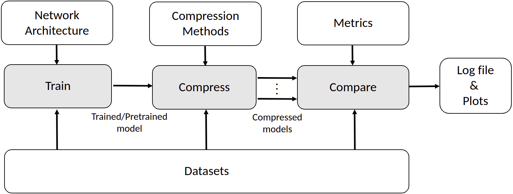

# NetZIP
This is the official repository for our paper: [*NetZIP: A Standardised Bench for DNNs Compression*](https://arxiv.org/abs/2305.10616)

NetZIP is an open-source benchmarking framework, based mainly on PyTorch, for evaluating the performance of model compression techniques on deep neural networks. It provides a standardized set of benchmarks and evaluation metrics for comparing different compression methods. The prominance of NetZIP is in the range of standardised evaluation metrics it provides to assess different aspects of performance affected by comrpession; these are broken into four main categories: accuracy, speed, size, and energy.

## List of currently supported frameworks:
Neural Networks (see [models](models)) :
- Object Classification: 
	- VGG 
	- ResNet

- Object Detection: 
	- YOLOv5

Compression Methods (see [methods](methods)):
- Pruning: 
	- Global Unstructure Pruning Random (GUP_R), 
	- Global Unstructure Pruning lowest L1-norm (GUP_L1)

- Quantisation: 
	- Post Training Quantisation (PTQ)
	- Quantisation Aware Training (QAT)

NetZIP is developed for the community to grow and utilise it. If there are particular neural network frameworks or compression methods that one would like us to add or would like to contribute to the NetZIP repository, please open an issue for your request to be take further. Thanks.

# Installation
1) Clone this repository: `git clone` 
2) Clone our docker image and setup container: `docker run -t --runtime=nvidia --shm-size 16G -d --name netzip -v ~/gits:/home -p 5000:80 abanoubg/netzip:latest`.

# Setup Datasets
Before starting with running experiments, setup datasets through the instructions listed
[here](readme/preparing_datasets.md).

# Quick Start
Inside `scripts/object_classification`
- Train: `python3 train.py -cf "./config/train/example_train.yml"`

- Compress PTQ: `python3 compress.py -cf "./config/compress/example_PTQ.yml"`

- Compress QAT: `python3 compress.py -cf "./config/compress/example_QAT.yml"`

- Compress GUP_R: `python3 compress.py -cf "./config/compress/example_GUP_R.yml"`

- Compress GUP_L1: `python3 compress.py -cf "./config/compress/example_GUP_L1.yml"`

- Compare: `python3 compare.py -cf "./config/compare/example_compare.yml"`

# Running Experiments
We provide scripts to [train](scripts/object_classificaiton/train.py), [compress](scripts/object_classificaiton/compress.py) and [compare](scripts/object_classificaiton/compare.py) using different metrics reviewed in our paper.

For object classificaiton:
- First use [train.py](scripts/object_classificaiton/train.py) to train your chosen nerual network. 

- Second use [compress.py](scripts/object_classificaiton/compress.py) to compress the trained neural network using the different compression methods provided. Note: The script will need to be run independently to generate copmressed models using different chosen compression technqiues. 

- Third use [compare.py](scripts/object_classificaiton/compare.py) to compare between the different compressed models. You can choose which metrics you wish to use. 

For object detection follow the same approach for object classificaiton but uses a different set of [train](scripts/object_detection/train.py), [compress](scripts/object_detection/compare.py) and [compare](scripts/object_detection/compare.py) scripts. Note, since we currently only use YOLOv5 for object detection experiments the current implementation of compression methods for object detection is reliant on the builtin compression techniques provied by [Ultralytics](https://github.com/ultralytics/yolov5), which are limited to tflite [Post Training Quantisation](models/yolov5/export.py) and [L1 Unstructured Pruning](models/yolov5/utils/torch_utils.py). 

# Further Info
For a list of useful tutorials that helped in constructing this repository please see [here](readme/useful_tutorials.md)

